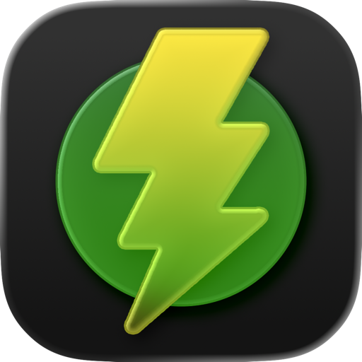

  

<h1 align="center">TorrServe Silicon</h1>

  <strong>Нативное приложение TorrServer для macOS</strong> 
  Медиатека, поиск торрентов и запуск просмотра — в одном приложении.

  <a href="https://github.com/HolyMayhem/TorrServe-Silicon/releases/latest">Скачать для macOS</a>
  &nbsp;·&nbsp;
  <a href="https://youtu.be/TmBXq8BSu-8">Смотреть видео</a>
  &nbsp;·&nbsp;
  <a href="README.md">English</a> · <strong>Русский</strong>

  
  
  

---

Добавьте magnet-ссылку или `.torrent`-файл. TorrServe Silicon определит фильм или сериал, загрузит постер, описание и рейтинги — останется нажать **«Смотреть»**.

Управляйте TorrServer и медиатекой из приложения без постоянного переключения в Терминал или Web UI TorrServer.

## Приложение в действии

  

  <a href="https://youtu.be/TmBXq8BSu-8"><strong>▶ Смотреть на YouTube</strong></a>

## Возможности

| | Что можно делать |
| --- | --- |
| **Встроенный TorrServer** | Запускайте сервер и управляйте им из приложения или строки меню macOS. |
| **Наглядная медиатека** | Добавляйте magnet-ссылки и `.torrent`-файлы, просматривайте библиотеку с постерами. |
| **Умные метаданные** | Автоматически определяйте фильмы, сериалы и аниме; загружайте описания, жанры, год и рейтинги. |
| **Поиск торрентов** | Находите и добавляйте раздачи прямо в приложении через необязательное подключение Jackett. |
| **Привычный плеер** | Запускайте просмотр в QuickTime, IINA, VLC или Infuse. |
| **Два языка интерфейса** | Пользуйтесь приложением на русском или английском. |

## Установка

**Нужны macOS 15 или новее и Mac с Apple Silicon.** Требуется интернет-соединение.

1. Скачайте последнюю версию `TorrServer-*-macOS-arm64.dmg` из [Releases](https://github.com/HolyMayhem/TorrServe-Silicon/releases/latest).
2. Откройте DMG и перетащите **TorrServe Silicon** в **Applications** («Программы»).
3. Запустите приложение.

TorrServer уже включён в приложение — отдельно устанавливать сервер не нужно.

> [!NOTE]
> Если macOS блокирует первый запуск, откройте **Системные настройки → Конфиденциальность и безопасность** и разрешите запуск приложения.

На macOS 26 приложение использует нативный **Liquid Glass**.

## Умные метаданные

Название торрента вроде `Interstellar.2014.2160p.UHD.BluRay.REMUX` может превратиться в карточку фильма с постером, названием, описанием, жанрами и рейтингом.

Для поиска используются **TMDB · OMDb · КиноПоиск · AniList**. Если один источник не нашёл информацию, приложение может попробовать следующий. AniList поддерживает поиск аниме.

Английские описания при необходимости могут переводиться на русский через системный **Apple Translation**.

## Поиск через Jackett

Подключите настроенный [Jackett](https://github.com/Jackett/Jackett), чтобы искать раздачи прямо внутри приложения:

**Найдите фильм → выберите торрент → добавьте → начните просмотр.**

Jackett необязателен. Медиатека, TorrServer и метаданные работают и без него.

## Благодарности

TorrServe Silicon — независимое приложение для работы с [YouROK/TorrServer](https://github.com/YouROK/TorrServer).

TorrServer и используемые сторонние сервисы являются отдельными проектами и распространяются на собственных условиях и лицензиях.
